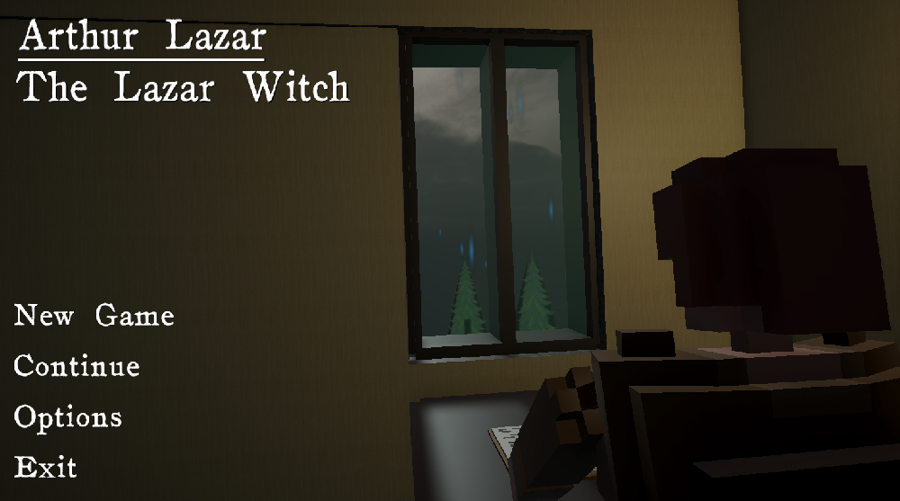
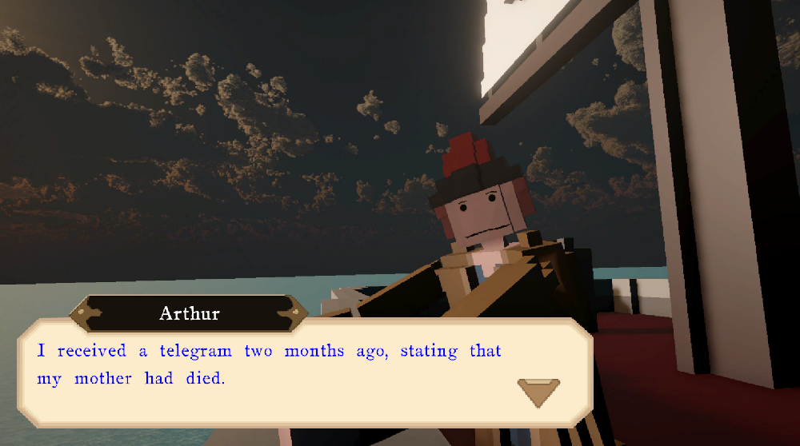
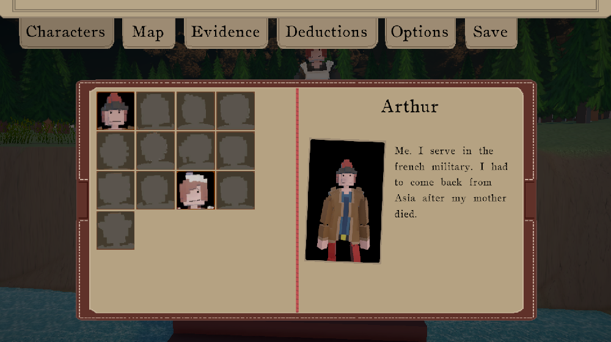
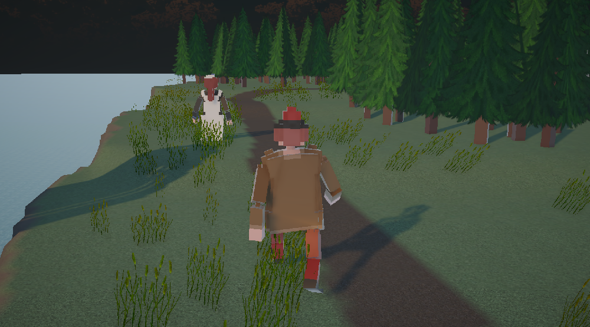

# Arthur Lazar - The Lazar Witch
This is the repository for the game **Arthur Lazar - The Lazar Witch**.

## Technologies used
- Unity Engine (2021)
- C#

## Description
This game is an adventure / detective game set in 1870s France. You play as a french officer, returning home after his mother died. However, he soons learn that she may have been killed by a witch. It is then your goal to find out if it's true, and if not, to find the true culprit.

The game isn't done yet, the first hour of gameplay is mostly done, but the story still needs to be finished.

There are numerous gameplay features in the game such as :
- Travel around the Island in first person, or in third person.
- Detective Vision. holding Left Control in game highlights important objects in the world.
- Cases. During the game, you will have to solve cases by collecting evidences, and then deducing what happened.
- Character biography. When you meet a new character, you will automatically gain access to their biography.
  
## Screenshots

## Links
<a href="https://helisoya.itch.io/arthur-lazar-the-lazar-witch">Itch.io page</a>
